# Green Fn

---

# **RecycleMate – Smart Recycling Helper App**

## 1. Project Ideation & Initiation

### **Group Members**

| No. | Name                                 | Matric No. |
| --- | ------------------------------------ | ---------- |
| 1   | AHMAD MUIZZUDDIN BIN AHMAD RIDZUAN   | 2211679    |
| 2   | MUHAMMAD AFIF BIN HUSNAN             | 2212583    |
| 3   | MUHAMMAD AMIR ZARIEFF BIN JEFNEE     | 2216919    |
| 4   | MUHAMMAD AFLAH BIN MOHAMAD ZULKHAIRI | 2217393    |

---


### **Group Members Tasks**

| Member                              | Assigned Tasks                                                                                                                                             |
| ----------------------------------- | ---------------------------------------------------------------------------------------------------------------------------------------------------------- |
| **AHMAD MUIZZUDDIN (2211679)**      | • Firebase User Authentication (Register, Login, Logout)<br>• Authentication UI Screens<br>• Form Validation & Error Handling<br>• User Session Management |
| **MUHAMMAD AFIF (2212583)**         | • Item Scanner using Camera Plugin<br>• Item Classification Logic<br>• Scan Result UI<br>• Firestore CRUD for Scan History                                 |
| **MUHAMMAD AMIR ZARIEFF (2216919)** | • Manual Search Feature<br>• Firestore Query/Search Logic<br>• Search Result UI<br>• Educational Tips & Recycling Guide Section                            |
| **MUHAMMAD AFLAH (2217393)**        | • Recycling Activity Tracker (CRUD)<br>• Weekly/Monthly Progress Summary Screen<br>• Chart/Progress Indicator UI<br>• Firestore Storage for User Logs      |

---

### **Shared Group Tasks (All Members)**

| Shared Tasks                              |
| ----------------------------------------- |
| UI/UX Design (Color theme, logo, layout)  |
| Navigation Flow & Screen Design           |
| GitHub Branching, Merging & Pull Requests |
| Weekly Progress Reporting                 |
| Integration of All Modules                |
| Debugging & Final Testing                 |
| Group Presentation                        |

---

### **Project Details**

1. **Title**
   
   RecycleMate – Smart Recycling Helper App

2. **Background of the Problem**
   
   Although recycling is encouraged worldwide, many adults still struggle to understand what can and cannot be recycled. Items like plastic containers, packaging, paper, and glass are often thrown into the wrong bin due to confusion. Incorrect sorting leads to contamination, making recyclable materials unusable and contributing to higher landfill waste. Adults may want to recycle, but inconsistent rules and lack of clear information make it difficult. A simple mobile app that gives instant guidance can help people recycle correctly and support environmental sustainability.

3. **Purpose / Objective**
   
   RecycleMate aims to help adults make smarter and more environmentally friendly waste disposal decisions. The main objectives are:

   * Identify whether an item is recyclable, non-recyclable, or requires special handling.
   * Provide correct disposal instructions in a simple and clear manner.
   * Educate users with recycling tips and common mistakes to avoid.
   * Encourage consistent recycling habits using a built-in tracking system.
   * Offer a fast and convenient tool that supports sustainable lifestyle choices.

4. **Target Users**
   
   The app is designed for adults aged 18–60, especially:

   * Homeowners
   * Working adults
   * Parents
   * People who manage household waste
   * Anyone who wants clearer recycling information

5. **Preferred Platform**
   **Flutter (Android)** – chosen because:

   * Enables fast UI design with built-in widgets.
   * Integrates well with Firebase Authentication & Cloud Firestore.
   * Supports required packages, plugins, and state management.
   * Cross-platform (Android → iOS future-ready).
   * Matches course requirement to use Flutter + Backend as a Service.

6. **Features and Functionalities**

   a. **User Authentication (Firebase)**

      * Register, login, logout
      * Email/password authentication
      * Form validation & error handling

   b. **Item Scanner & Classification**

      * Use phone camera to scan items
      * Identify item type (plastic, paper, glass, metal, food packaging)
      * Display appropriate disposal instructions

   c. **Manual Search Feature**

      * Search for items using text input
      * Returns correct recycling method
      * Firestore integration for item data

   d. **Recycling Tips & Educational Content**

      * Do’s and don’ts
      * Common recycling mistakes
      * Eco-friendly lifestyle suggestions

   e. **Recycling Activity Tracker**

      * Users log items they recycle
      * Weekly/monthly progress summary
      * Motivational eco-progress charts

   f. **Firebase Firestore Storage (CRUD)**

      * Store user profile, scan history, search history, activity logs
      * All features use Create, Read, Update & Delete operations

   g. **Clean & Consistent UI/UX**

      * Clear icons and labeling
      * Simple navigation layout
      * Consistent color theme and screen structure

**How We Came Up With the App Idea:**

Our group wanted to develop an app that solves a real-world problem while being achievable using Flutter. Recycling confusion is a common issue among adults, leading to incorrect waste management and environmental pollution. RecycleMate helps adults recycle confidently with instant guidance and helpful learning features. The app fits the course requirements because it uses packages, plugins, authentication, backend storage, CRUD operations, and well-structured UI/UX principles. It also provides an opportunity for each group member to implement equally challenging tasks.

---

## 2. Requirement Analysis & Training

### Data Storage & CRUD Operations

#### Database Collections

**Collection 1: `recycling_activities`**
```json
{
  "userId": "string",
  "materialType": "string",
  "weight": "double (KG)",
  "points": "integer",
  "date": "Timestamp",
  "status": "string"
}
```

**Collection 2: `scan_records`**
```json
{
  "userId": "string",
  "code": "string",
  "materialType": "string",
  "weightKg": "double",
  "points": "integer",
  "createdAt": "Timestamp"
}
```

#### CRUD Operations

**CREATE** - Add new activity:
```dart
Future<String> addActivity(RecyclingActivity activity) async {
  DocumentReference docRef = await _collection.add(activity.toMap());
  return docRef.id;
}
```

**READ** - Get user activities:
```dart
Stream<List<RecyclingActivity>> getUserActivities(String userId) {
  return _collection
      .where('userId', isEqualTo: userId)
      .orderBy('date', descending: true)
      .snapshots();
}
```

**UPDATE** - Update activity:
```dart
Future<void> updateActivity(RecyclingActivity activity) async {
  await _collection.doc(activity.id).update(activity.toMap());
}
```

**DELETE** - Delete activity:
```dart
Future<void> deleteActivity(String activityId) async {
  await _collection.doc(activityId).delete();
}
```

---

### Packages and Plugins

#### Current Dependencies

| Package | Version | Purpose | Smartphone | Wearable |
|---------|---------|---------|------------|----------|
| firebase_core | 3.8.1 | Firebase init | ✅ | ✅ |
| firebase_auth | 5.3.4 | Authentication | ✅ | ✅ |
| cloud_firestore | 5.6.0 | Database | ✅ | ✅ |
| image_picker | 1.0.4 | Camera access | ✅ | ❌ |
| http | 1.1.0 | API requests | ✅ | ✅ |
| fl_chart | 1.1.1 | Charts | ✅ | ⚠️ |
| email_validator | 3.0.0 | Validation | ✅ | ✅ |
| intl | 0.20.2 | Formatting | ✅ | ✅ |

**Compatibility:**
- ✅ Fully compatible
- ⚠️ Limited support (small screens)
- ❌ Not supported (no camera on most wearables)

---

### Platform Compatibility

### Smartphones: ✅ EXCELLENT
- **Android:** API 21+ (99% devices)
- **iOS:** iOS 12.0+ (95% devices)
- All features fully supported

### Wearables: ⚠️ LIMITED
- **Wear OS:** Requires separate module
- **Apple Watch:** Needs native SwiftUI app
- **Limitations:** No camera, small screen, limited battery

**Recommendation:** Focus on smartphones first

---

### Sequence Diagrams

#### User Login

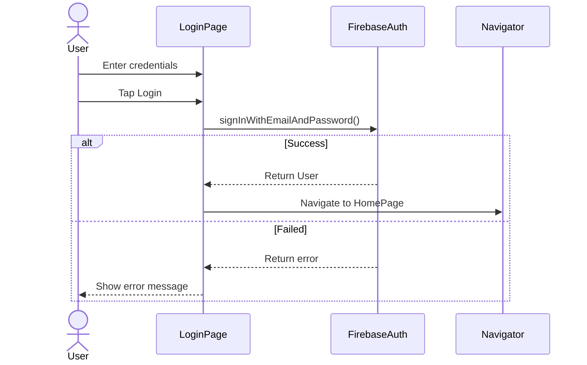

#### Scan Item

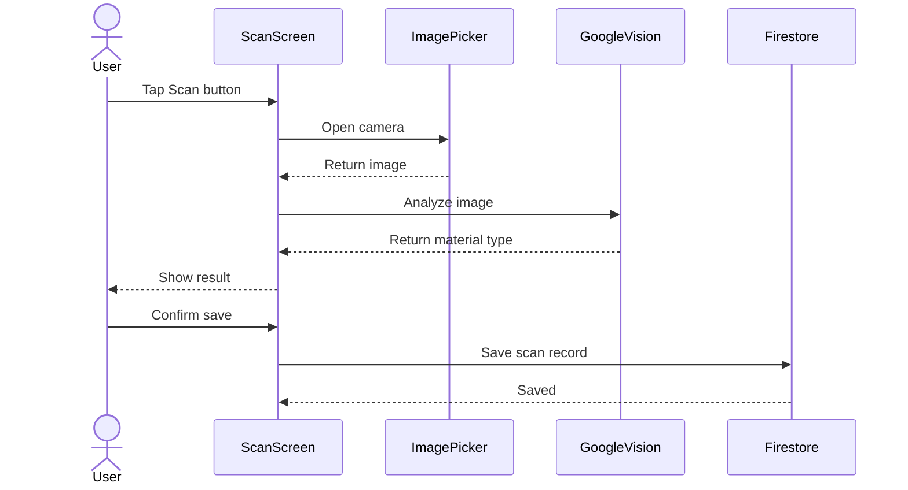

#### Add Activity

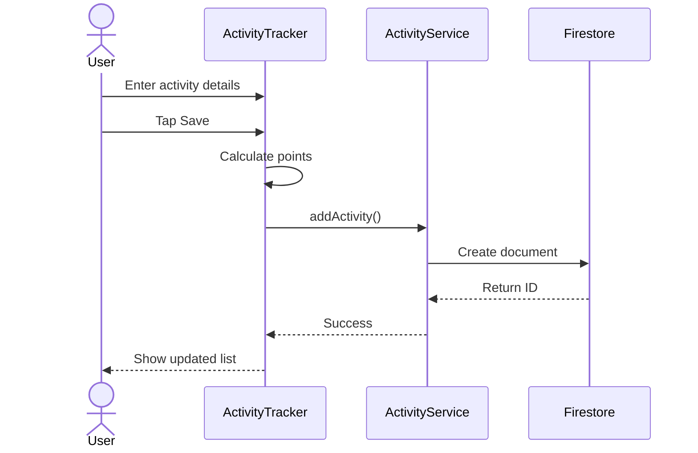

#### View Progress

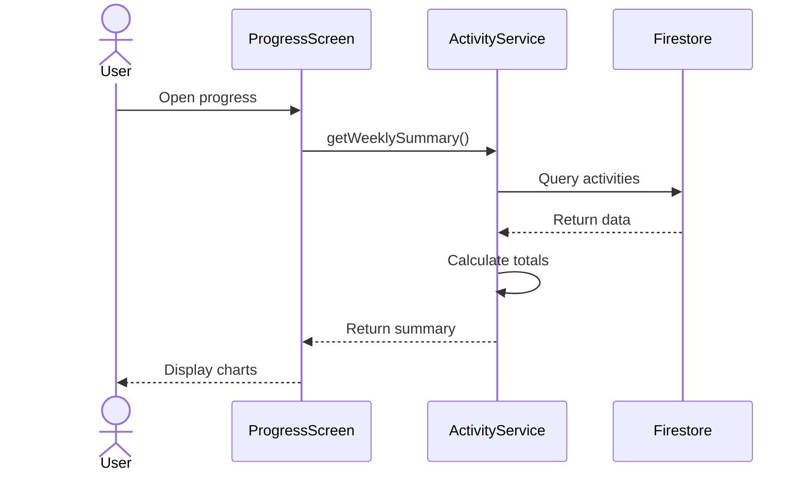

---

### Screen Navigation Flow

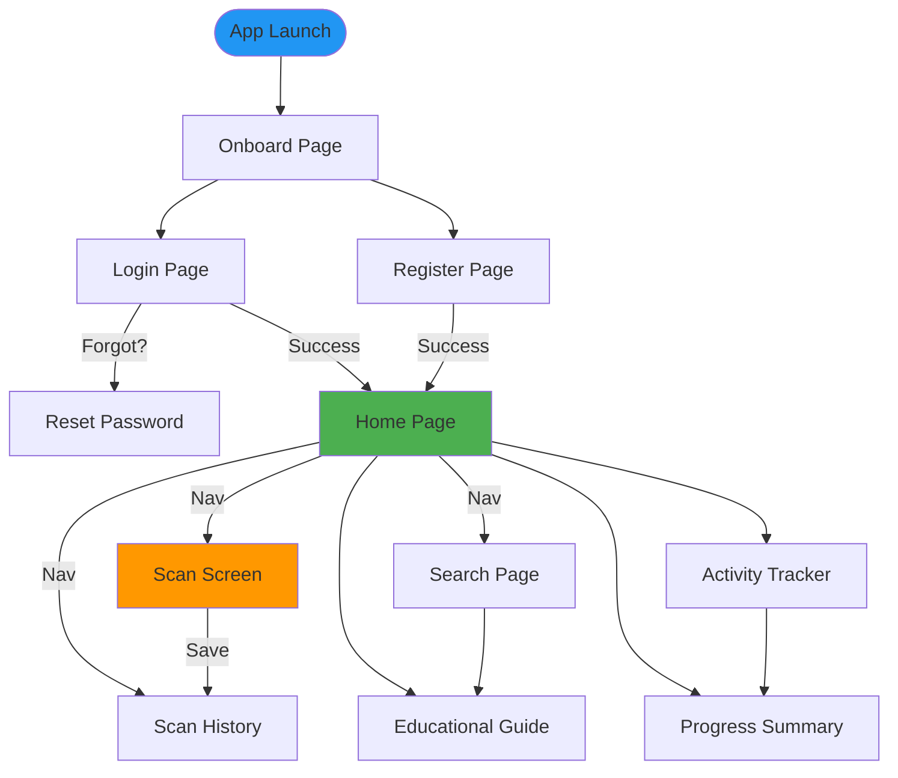

#### Navigation Routes

```dart
Routes:
  / → OnboardPage
  /login → LoginPage
  /register → RegisterPage
  /home → HomePage
  /scan → ScanScreen
  /scan-history → ScanHistoryScreen
  /search → SearchPage
  /educational-guide → EducationalGuidePage
  /activity-tracker → ActivityTrackerScreen
  /progress-summary → ProgressSummaryScreen
```

#### Bottom Navigation (HomePage)

```
┌─────────────────────────────────┐
│       RecycleMate               │
├─────────────────────────────────┤
│     [Main Content]              │
├─────────────────────────────────┤
│ [Home] [Scan] [Search] [History]│
└─────────────────────────────────┘
```

---

## Gantt Chart


## 3. Project Design & Architecture

We prioritized a user-centric design philosophy to ensure the app is accessible and efficient for our target audience.

### 3.1 User Interface (UI)
*Designed for mobile-first interaction.*
* **Touch Optimization:** All interactive elements (buttons, icons) adhere to a minimum touch target size of 48x48px to accommodate thumb navigation.
* **Responsive Layouts:** Utilized Flutter's `Flexible` and `Expanded` widgets to prevent overflow errors on different screen sizes.
* **Visual Feedback:** Immediate visual cues (loading indicators, snackbars) are used to keep users informed of app stat

<table>
  <tr>
    <td>Figma Design</td>
    <td>Flutter App</td>
  </tr>
  <tr>
    <td>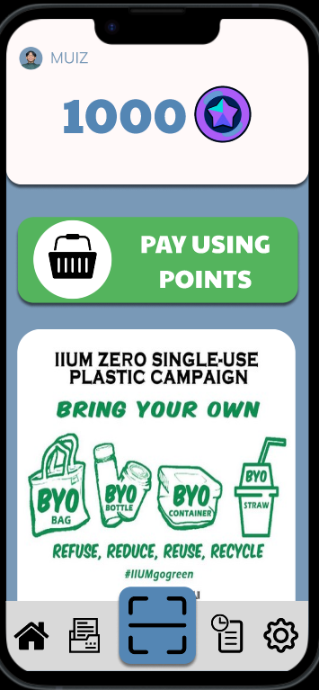</td>
    <td>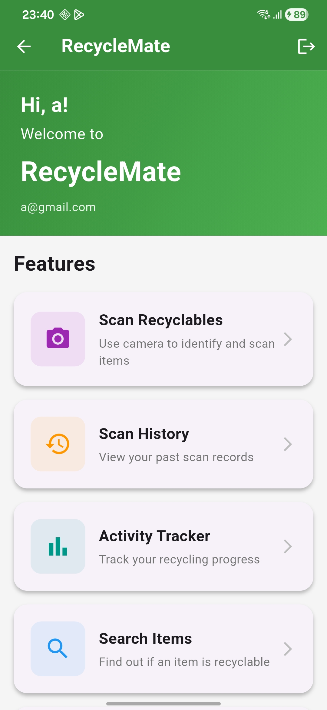</td>
  </tr>
</table>

### 3.2 User Experience (UX)
*Navigation with human intuition.*
* **Linear Workflows:** The scanning process follows a strict linear path: `Dashboard -> Camera -> Processing -> Result`, reducing cognitive load.
* **Persistent Navigation:** A bottom navigation bar allows instant switching between core features (Home, Scan, Tracker, Profile) without losing context.
* **Error Prevention:** Input validation (e.g., on Login forms) prevents errors before they occur.

<table>
  <tr>
     <th align="center">Step 1: Dashboard</th>
    <th align="center">Step 2: Scan Item</th>
    <th align="center">Step 3: Result</th>
  </tr>
  <tr>
    <td align="center">
      
    </td>
    <td align="center">
      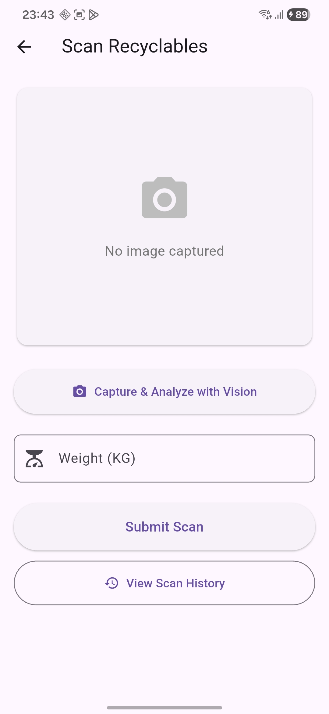
    </td>
    <td align="center">
      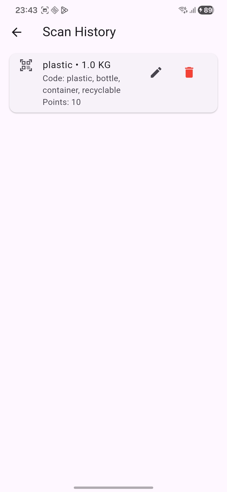
    </td>
  </tr>
</table>

### 3.3 Consistency
*Unified design language.*
* **Global Theme:** We implemented a centralized `ThemeData` in `main.dart` to enforce our "Eco Green" (#4CAF50) color palette across all screens.
* **Reusable Widgets:** Custom components (e.g., `CustomButton`, `CustomTextField`) were created to ensure identical padding, border radius, and typography throughout the app.

<table>
  <tr>
    <td>Login screen</td>
    <td>Search Screen</td>
  </tr>
  <tr>
    <td>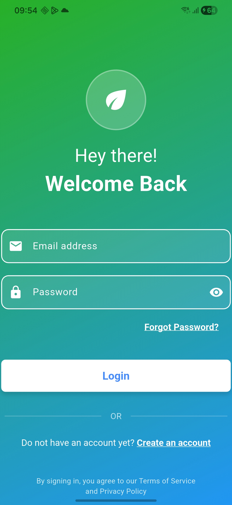</td>
    <td>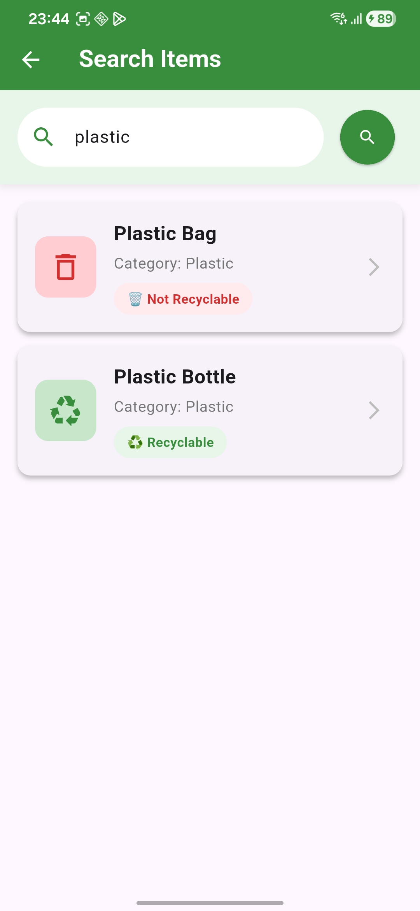</td>
  </tr>
</table>

## 4. Project Development

The development of RecycleMate focused on building a reliable and scalable mobile application. We utilized Flutter for cross-platform development to ensure a smooth user interface on Android, while Firebase was selected as our Backend-as-a-Service (BaaS) to manage data and authentication securely and efficiently.

#### 4.1 Functional Implementation

We implemented all core features proposed in the project initiation phase. The development was organized into distinct modules to ensure the application was easy to test and debug:

* **User Authentication:**
    1.  We established a secure login system using Firebase Authentication, allowing users to register and sign in reliably
    2.  To maintain data quality, we integrated the email_validator package. This ensures that all user inputs are validated for correct formatting before being sent to the backend.

* **Item Scanning & Classification:**
    1.  The scanning module utilizes the image_picker package to interface with the device's camera and gallery.
    2.  For image analysis, we developed a custom GoogleVisionService. Instead of processing images locally, this service converts images to Base64 format and transmits them securely to the Google Cloud Vision API via HTTP requests. The API analyzes the image content and returns label annotations (e.g., "Plastic," "Glass").
    3.  These labels are then processed by our ItemClassifier to determine the correct waste category and display disposal instructions.

* **Activity Tracker:**
    1.  We implemented a complete CRUD (Create, Read, Update, Delete) system for tracking recycling habits, with data persistently stored in Cloud Firestore.
    2.  To visualize user progress, we integrated the fl_chart library, which renders dynamic bar and line charts on the ProgressSummaryScreen.

* **Manual Search:**
    1.  A manual search feature allows users to query the Firestore database directly. This ensures users can find recycling guidelines even if the scanner cannot identify an item.

#### 4.2 Code Structure and Architecture

To ensure the project remains maintainable and collaborative, we adopted a Layered Architecture that separates different aspects of the code:

1.  **Presentation Layer (UI):**
    All user interface components are located in the lib/screens/ and lib/Pages/ directories. These screens are built using modular Flutter widgets to ensure a consistent design across different devices.

2.  **Service Layer (Logic):**
    Business logic and external API interactions are abstracted into the lib/services/ directory. For instance, google_vision_service.dart handles API communication, while recycling_activity_service.dart manages database operations. This separation keeps the UI code clean and focused on display logic.

3.  **Data Layer (Models):**
    We defined specific data models, such as ScanRecord and RecyclingActivity, in the lib/models/ directory. These classes ensure data consistency and type safety throughout the application.

#### 4.3 Packages and Dependencies

The application leverages several key packages to extend its functionality:

1.  **firebase_core & cloud_firestore:** facilitates connection to the Firebase backend and enables real-time database storage.
2.  **image_picker:** enables access to the device's camera and photo library.
3.  **http:** allows the app to send RESTful API requests to the Google Cloud Vision API.
4.  **fl_chart:** provides the tools to render visual graphs for the user's progress summary.
5.  **intl:** handles date formatting to ensure timestamps are displayed correctly in the activity logs.

#### 4.4 Backend Infrastructure (Firebase)

We selected Firebase to provide a scalable backend infrastructure without the need for managing physical servers.

* **Authentication:** Centralizes user management and secures session tokens.
* **Cloud Firestore:** Stores user profiles, scan history, and activity logs in a flexible, document-based structure that supports efficient querying.

#### 4.5 Collaborative Development

The project was managed using GitHub to facilitate teamwork.

* **Branching Strategy:** We utilized feature branches (e.g., feature/scanner, feature/auth) to isolate development tasks and prevent conflicts.
* **Code Review:** Pull requests were used to review and merge code into the main branch, ensuring stability and code quality.

### 5. References

**Youtube Tutorial Videos**
* HeyFlutter.com/Youtube.com. (2023). Flutter Firebase Authentication [2024] The Cleanest Way . https://www.youtube.com/watch?v=4vKiJZNPhss&list=LL&index=1
    * Usage: Assisted in injecting firebase into our projects including login, register and forget password

**Packages & Software**

* Flutter Team. (n.d.). Flutter (Version 3.10.0) [Software Development Kit]. Google. https://flutter.dev
* Google. (n.d.). Firebase [Backend-as-a-Service Platform]. https://firebase.google.com
* Flutter Team. (2025). image_picker (Version 1.0.4) [Computer software]. Pub.dev. https://pub.dev/packages/image_picker
* Flutter Team. (2025). email_validator (Version 3.0.0) [Computer software]. Pub.dev. https://pub.dev/packages/email_validator
* Khoshabi, I. (2025). fl_chart (Version 1.1.1) [Computer software]. Pub.dev. https://pub.dev/packages/fl_chart
* Firebase Team. (2025). cloud_firestore (Version 5.6.0) [Computer software]. Pub.dev. https://pub.dev/packages/cloud_firestore
* Firebase Team. (2025). firebase_auth (Version 5.3.4) [Computer software]. Pub.dev. https://pub.dev/packages/firebase_auth
* Dart Team. (2025). http (Version 1.1.0) [Computer software]. Pub.dev. https://pub.dev/packages/http

**Generative AI Tools**

* Google. (2026). Gemini [Large language model]. https://gemini.google.com
    * Usage: Assisted in generating the initial project structure, debugging Flutter widget trees, and formatting the documentation.
    * Usage: Assisted in suggesting suitable colors, transparent design, mini pages on Onboarding page.
* OpenAI. (2025). ChatGPT (GPT-4) [Large language model]. https://chat.openai.com
    * Usage: Used for brainstorming the "RecycleMate" app concept and refining the problem statement in the Project Initiation phase.

